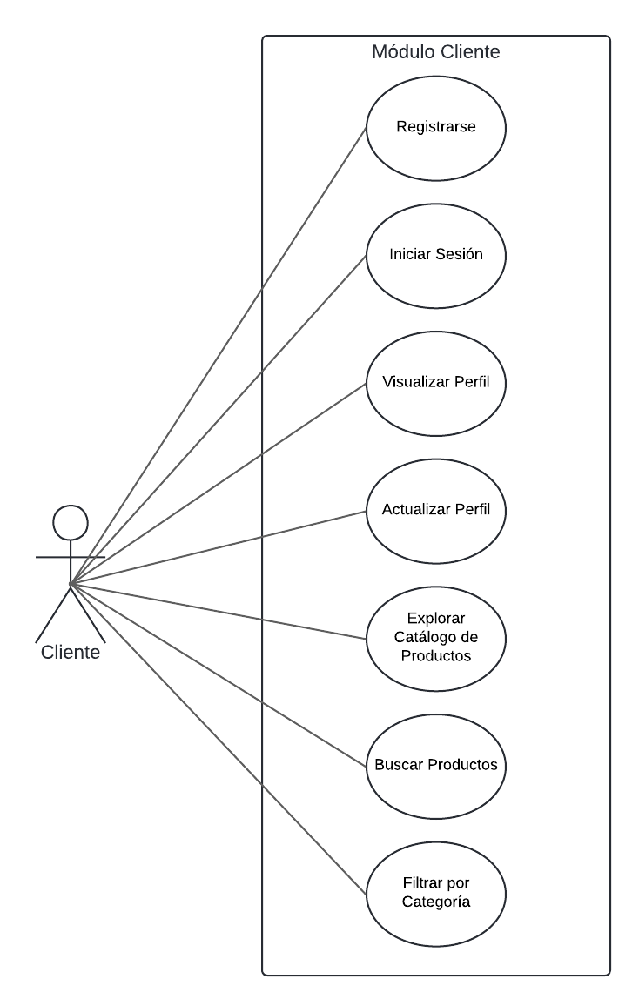
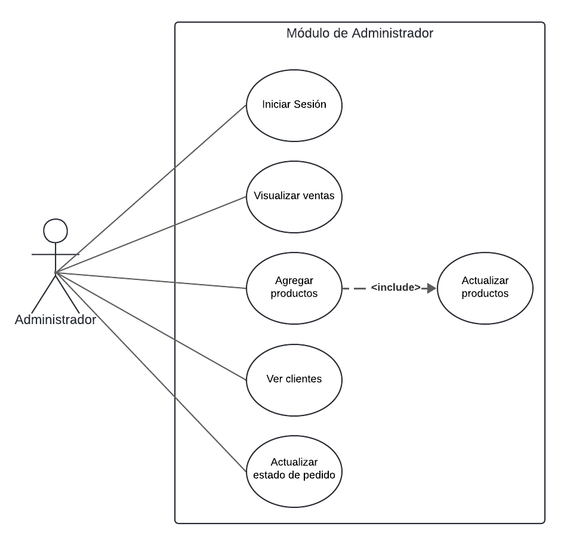
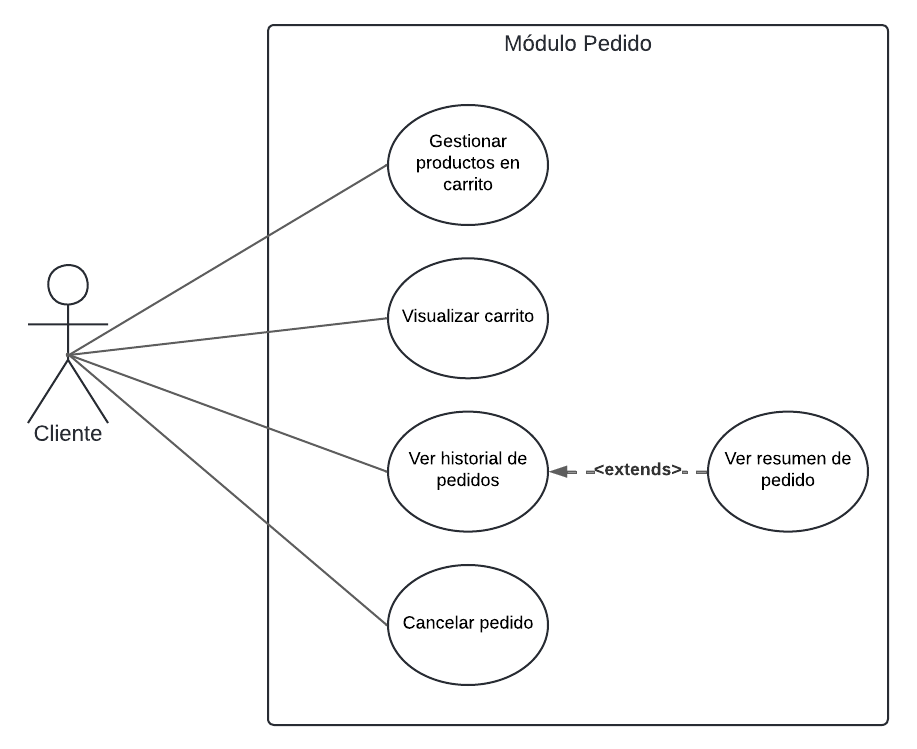

# ShopKart : E-commerce Website

## Integrantes

- Alpaca Torres, Wilbert Rider. **usuario: yae-os**
- Cama Choque, Edison Nicolas. **usuario: LiaR2128**
- Carpio Mollo, Camila. **usuario: camtcm**
- Saravia Apaza, Damaris Ilenne. **usuario: Ilenn2004**
- Villanueva Linares, Mario Raid. **usuario: mavillanueva24**

## Propósito del proyecto

ShopKart es una plataforma de comercio electrónico, permite a los usuarios explorar un catálogo de productos,
gestionar su carrito de compras y realizar pedidos. Adicionalmente, cuenta con un panel de administración para gestionar el inventario, los clientes y supervisar las ventas.

## Funcionalidades

Las principales funcionalidades del sistema son:

1. **Gestión de Clientes**: Registro, inicio de sesión, visualización y actualización de perfil de usuario.
2. **Catálogo de Productos**: Catálogo de productos, búsqueda por nombre y filtrado por categoría.
3. **Carrito de Compras**: Agregar productos al carrito, incrementar y disminuir la cantidad de artículos.
4. **Gestión de Pedidos**: Realizar pedidos desde el carrito, cancelar pedidos, ver historial y resumen de pedidos.
5. **Panel de Administración**: Inicio de sesión administrativo, visualización de ventas, agregar/actualizar productos, ver clientes y actualizar estado de pedidos.

### Casos de uso

## Módulos

El sistema está compuesto por los siguientes módulos principales que agrupan la lógica del negocio:

- **Customer**: Gestiona la información del usuario comprador.
- **Product**: Define las características y disponibilidad de los artículos.
- **Cart**: Gestiona los ítems seleccionados para la compra.
- **Order**: Representa la transacción y el historial de compras.
- **Admin**: Gestiona los privilegios y control del sistema.

## Visión General de Arquitectura: DDD y Arquitectura Limpia

- **Domain (`cart/domain`, `product/domain`)**: Entidades centrales y agregados (ej. `CartItem`, `Product`).
- **Application (`cart/application`, `product/application`)**: Servicios que orquestan los casos de uso (ej. `CartItemService`, `ProductService`).
- **Infrastructure (`cart/infrastructure`, `product/infrastructure`)**: Implementaciones técnicas y acceso a datos (ej. `CartItemRepository`, `ProductRepository`).
- **Presentation (`cart/presentation`, `product/presentation`)**: Controladores que manejan las peticiones HTTP (ej. `CartItemController`, `ProductController`).

## Módulos y principales servicios REST disponibles

### Módulo: Product

- **Propósito**: Gestión y visualización del catálogo de productos.
- **Operaciones disponibles**:
  - `GET /product`: Obtener el catálogo completo.
  - `GET /product/category/{category}`: Filtrar productos por categoría. (Parámetro: `category` - Path variable)
  - `GET /product/search`: Buscar productos por prefijo. (Parámetros: `prefix` - Query parameter)
  - `GET /product/{id}`: Obtener detalles de un producto específico. (Parámetro: `id` - Path variable)
- **Modelos**: `Product`

### Módulo: Cart

- **Propósito**: Gestión del carrito de compras del usuario.
- **Operaciones disponibles**:
  - `GET /cartitem/cart`: Obtener los ítems actuales en el carrito del cliente.
  - `POST /cartitem/add/{prod_id}`: Añadir un nuevo producto al carrito. (Parámetro: `prod_id` - Path variable)
  - `POST /cartitem/increase/{slno}`: Incrementar la cantidad de un ítem en el carrito. (Parámetro: `slno` - Path variable)
  - `POST /cartitem/decrease/{slno}`: Disminuir la cantidad de un ítem en el carrito. (Parámetro: `slno` - Path variable)
  - `POST /cartitem/delete/{slno}`: Eliminar un ítem del carrito. (Parámetro: `slno` - Path variable)
- **Modelos**: `CartItem`

---

## Falta implementar

Falta implementar los siguientes aspectos:

### Migración a DDD y Arquitectura Limpia

Los siguientes módulos aún no han sido migrados a la nueva arquitectura y mantienen su estructura original:

- **Customer**
- **Order**
- **Admin**

### Documentación y estandarización de Servicios REST

Falta documentar e implementar los servicios REST bajo el mismo formato para los siguientes módulos:

- **Customer**
- **Order**
- **Admin**

### Pruebas de Seguridad y Rendimiento

Se realizaron pruebas de seguridad y rendimiento de manera manual en una versión pasada del proyecto , sin embargo, actualmente estas no se encuentran automatizadas ni implementadas dentro de un pipeline de integración continua.
